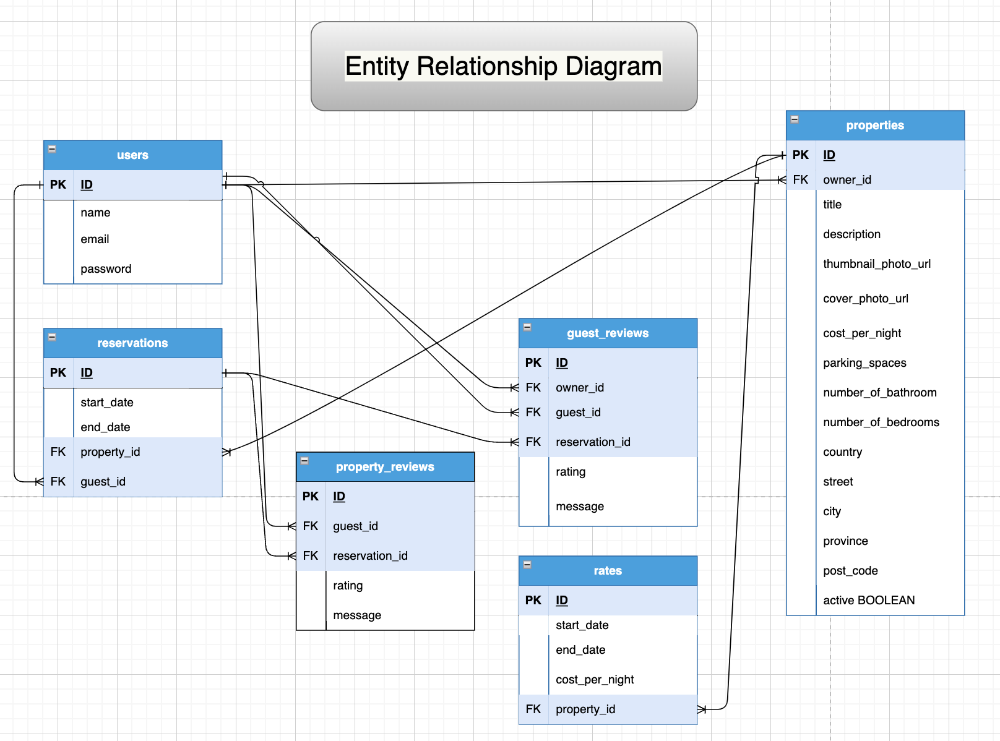
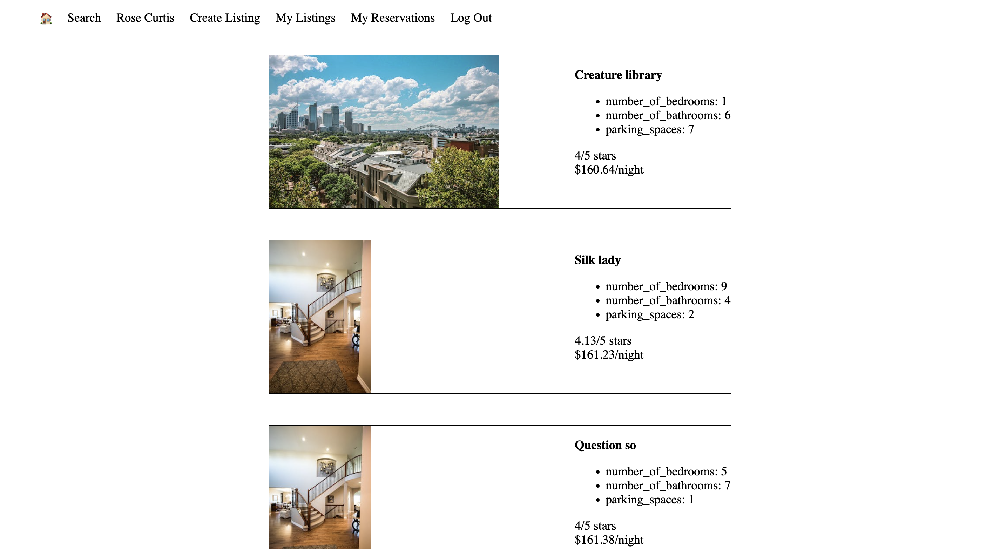
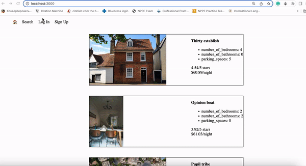

# LightBnB
A simple multi-page AirBnB clone that uses server-side JavaScript to display the information from queires to web pages via SQL queries.
## Purpose
The purpose of this project is to design a database and use server-side JavaScript to display the information from queries to web pages. As well as apply knowledge of complex SQL queries, database and ERD (entity relationship diagram) design to integrate the database with a Node backend.

## Project Outcomes
 * Design the database and create an ERD for the tables.
 * Create the database and the tables using the ERD.
 * Add fake data to the database to make testing queries easier.
 * Write queries.
 * Connect the database to a JavaScript application in order to interact with the data from a web page.


## Learning Outcomes
   * Explain the importance and application of SQL/relational databases for web applications.
   * Describe the key components that make up a relational database.
   * Design database tables using primary and foreign keys correctly.
   * Determine if a data model should use one-to-many or many-to-many relationships when designing relational databases.
   * Utilize SELECT statements to solve common data query questions involving GROUP BY, WHERE, LIMIT, ORDER.
   * Utilize CREATE, UPDATE, DELETE statements to modify existing database table structure and records.
   * Use JOIN statements to combine information from related tables to build more complex result sets.
   * Use asynchronous (promise-based) postgres JS libraries to query data from Node applications.
   * Use the psql CLI to interact with and explore a database.
   * Research database queries through documentation and other references.

## Getting Started
- Clone the repository [here](https://github.com/KShilina/LightBnB)
- Navigate to the project directory `cd lightBnB` then 
`cd LightBnB_WebApp`
- Install all dependencies (using the `npm install` command).
- To start the project `npm start`
- To start the application `npm run local`
- Open the application on http://localhost:3000

## Dependencies

- `Express` Web framework for Node.js `npm i express`
- `node` Version `nvm use 15.14.0`
- `pg` PostgreSQL client for Node.js `npm i pg`
- `bcrypt` The library to hash passwords `npm i bcrypt`
- `cookie-session` Cookie - based session middleware `npm i cookie-session`
- `dotenv` Loads environment variables from a .env file `npm i dotenv`
- `nodemon` Simple monitor script for use during development of a Node.js app 

## LightBnB_WebApp Project Structure

```
.
├── db
│   ├── json
│   └── index.js.js
    └── properties.js
    └── users.js
├── public
│   ├── javascript
│   │   ├── components 
│   │   │   ├── header.js
│   │   │   ├── login_form.js
│   │   │   ├── new_property_form.js
│   │   │   ├── property_listing.js
│   │   │   ├── property_listings.js
│   │   │   ├── search_form.js
│   │   │   └── signup_form.js
│   │   ├── libraries
│   │   ├── index.js
│   │   ├── network.js
│   │   └── views_manager.js
│   ├── styles
│   │   ├── main.css
│   │   └── main.css.map
│   └── index.html
├── routes
│   ├── apiRoutes.js
│   └── userRoutes.js
├── styles  
│   ├── _forms.scss
│   ├── _header.scss
│   ├── _property-listings.scss
│   └── main.scss
├── .gitignore
├── package-lock.json
├── package.json
└── server.js
```

* `db` contains all the database interaction code.
  
  * `json` is a directory that contains a 
  bunch of dummy data in `.json` files.
  * `index.js` is responsible for a connection pool to a PostgreSQL database.
  * `properties.js` is responsible for all queries related to properties. It doesn't currently connect to any database, all it does is return data from `.json` files.
  * `users.js` is responsible for all queries related to users. It doesn't currently connect to any database, all it does is return data from `.json` files.

* `public` contains all of the HTML, CSS, and client side JavaScript. 
  * `index.html` is the entry point to the application. It's the only html page because this is a single page application.
  * `javascript` contains all of the client side javascript files.
    * `index.js` starts up the application by rendering the listings.
    * `network.js` manages all ajax requests to the server.
    * `views_manager.js` manages which components appear on screen.
    * `components` contains all of the individual html components. They are all created using jQuery.
* `routes` contains the router files which are responsible for any HTTP requests to `/users/something` or `/api/something`. 
* `styles` contains all of the sass files. 
* `server.js` is the entry point to the application. This connects the routes to the database.



## Screenshot of Application

## Demo


